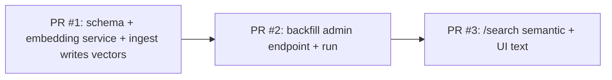

# Semantic Search Design

**Date**: 2026-05-03
**Status**: Approved (brainstorming phase)
**Owner**: @paveg
**Target ship**: 3 PRs over ~1-2 weeks

## 1. Background and goals

### 1.1 Why now

tailf currently exposes keyword search via SQLite FTS5 with a trigram tokenizer (`apps/api/migrations/0005_add_fts5_search.sql`, `apps/api/src/routes/posts.ts:224-313`). It works, but ranks results purely by `published_at DESC` rather than relevance, has no highlighting, and indexes only `title + summary`.

The product's positioning under the user's current priority (B = developer-community buzz > C = retention > A = SEO) needs a clear differentiator. "Japanese tech blogs you can search by meaning" is a one-line pitch that lands on X / Zenn / はてブ.

### 1.2 The unused asset

The codebase already calls `@cf/baai/bge-m3` in three independent places (`tech-score.ts`, `topic-assignment.ts`, `feeds.ts`) to compute embeddings, then **discards the vectors** after using them for classification. Storing those vectors costs almost nothing and unlocks semantic search.

### 1.3 Goals

1. Allow users to search 4,985+ posts by natural-language Japanese queries that match meaning, not just keywords.
2. Replace the existing `/api/posts/search` implementation with semantic search while keeping the URL, query parameters, and response shape stable.
3. Make ongoing embedding cost zero by piggybacking on existing tech-score/topic-assignment compute.
4. Ship in three independently-deployable PRs, each ≤ ~150 effective LOC.

### 1.4 Non-goals (explicitly deferred)

- "Similar posts" recommendations on the article detail page (follow-up PR; the foundation laid here makes it ~30 LOC)
- MCP server exposure
- User personalization / follow-based timeline
- Migration to Cloudflare Vectorize (revisit when corpus exceeds ~50K posts)
- Removal of unused features (`MyFeeds`, certain topic pages) — observe with analytics first

## 2. Constraints and inputs

| Item | Value | Source |
|------|-------|--------|
| Posts in production D1 | ~4,985 | `wrangler d1 execute --remote ... rows_read: 4985` |
| Feeds | 60 | same |
| Oldest post | 2016-05-25 | same |
| DB size today | ~18 MB | `size_after: 18632704` |
| Embedding model | `@cf/baai/bge-m3` (1024-dim) | already in use |
| Workers plan | Paid ($5/mo) | confirmed by user |
| AI free tier | n/a once on Paid | Cloudflare pricing |
| Storage budget for embeddings | +~20 MB now, ~200 MB at 50K posts | 4,985 × 1024 × 4 bytes |

## 3. Architecture

### 3.1 High-level data flow

```mermaid
flowchart LR
  RSS[RSS fetcher\nrss.ts] --> EMB[embedding service\nservices/embedding.ts]
  EMB --> TS[tech-score]
  EMB --> TA[topic-assignment]
  EMB --> STORE[posts.embedding BLOB]
  STORE --> D1[(D1 SQLite)]

  USER[User query] --> SEARCH[semantic-search service]
  SEARCH --> EMB2[embedding service]
  EMB2 --> AI[Workers AI BGE-M3]
  SEARCH --> D1
  D1 --> RANK[in-process cosine ranking]
  RANK --> RESP[/api/posts/search response]
```

Key shifts vs. today:

- A single `services/embedding.ts` becomes the only caller of `ai.run('@cf/baai/bge-m3', ...)`. Existing call sites delegate to it.
- The vector that was previously consumed-and-discarded by `tech-score` is now also written to `posts.embedding`.
- `/api/posts/search` becomes vector-first; FTS5 stays in the schema as a fallback path for short queries.

### 3.2 Component boundaries

| Module | Responsibility | Depends on |
|--------|----------------|-----------|
| `services/embedding.ts` (new) | Single entrypoint for BGE-M3. Returns L2-normalized `Float32Array`. Batch-aware. | `Ai` binding |
| `services/semantic-search.ts` (new) | Turn a query string + filters into a ranked list of post IDs. Pure function (no HTTP). | `embedding`, `db` |
| `routes/posts.ts` (modify) | HTTP wrapper around `semantic-search`. Validates input, builds cursor response. | services |
| `routes/admin.ts` (modify) | Backfill orchestration endpoint. | `embedding`, `db` |
| `db/schema.ts` (modify) | Add `embedding` BLOB column. | drizzle |

## 4. Data model

### 4.1 Schema change

```sql
-- Generated by drizzle-kit (do NOT hand-write)
ALTER TABLE posts ADD COLUMN embedding BLOB;
CREATE INDEX idx_posts_embedding_present ON posts(id) WHERE embedding IS NOT NULL;
```

### 4.2 Encoding

- 1024 × `Float32` little-endian, **L2-normalized** before write.
- Wire format = `Float32Array.buffer` → `Uint8Array` → BLOB (4096 bytes).
- Reading: `new Float32Array(blob.buffer, blob.byteOffset, 1024)`.

Rationale for L2-normalizing on write: cosine similarity reduces to a dot product, saving a `sqrt` and a divide per post during search (~30% CPU win per query).

### 4.3 Migration & coexistence

- Column is nullable. Posts ingested before backfill have `NULL`.
- Search uses `WHERE embedding IS NOT NULL` to filter. NULL posts fall through to FTS5/LIKE path automatically until backfilled.
- Drizzle migration generated via `pnpm db:generate`; commit unchanged per `development-principles.md`.

### 4.4 Embedding text recipe

```
embedText = `${title}\n${summary ?? ''}`
```

Matches what `tech-score.ts` already feeds the model. We do not include `feed.title` or topic names — those add noise and are already searchable via filters.

## 5. API contract

### 5.1 `GET /api/posts/search` (replaced implementation, same URL)

Query parameters (unchanged):

| Name | Type | Required | Notes |
|------|------|----------|-------|
| `q` | string | yes | 1–100 chars |
| `cursor` | string | no | opaque |
| `limit` | number | no | default 20 |
| `techOnly` | boolean | no | |
| `official` | boolean | no | |
| `topic` | string | no | |

Behavior:

| Condition | Path |
|-----------|------|
| `q.length >= 3` AND AI binding healthy | semantic search |
| `q.length < 3` | LIKE fallback (existing logic) |
| AI unavailable / rate-limited | LIKE fallback (graceful degradation, log warning) |

Response (extended):

```typescript
{
  data: PostWithFeed[],
  meta: {
    hasMore: boolean
    nextCursor: string | null
    query: string
    mode: 'semantic' | 'keyword'   // NEW
  }
}
```

`mode` lets the frontend show "意味的に近い順" indicator and lets us debug.

### 5.2 Pagination

Initial implementation uses **offset-encoded cursor** for the semantic path:

- Cursor format: `base64({offset: number})`
- We compute scores for all candidate rows once per request and slice. With ~5K rows × 1024 floats this is cheap (see §6).
- Cursor remains opaque to clients, so we can swap to a real cursor strategy later (e.g., score-based) without API breakage.

The keyword path keeps its existing cursor.

### 5.3 `POST /api/admin/embeddings/backfill` (new)

```
Headers: Authorization: Bearer ${ADMIN_SECRET}
Body:    { batchSize?: number /* default 100, max 200 */ }
Returns: {
  processed: number,
  remaining: number,
  durationMs: number,
  done: boolean
}
```

- Selects `WHERE embedding IS NULL ORDER BY published_at DESC LIMIT batchSize`.
- One BGE-M3 batch call per request (well under subrequest budget).
- Idempotent: rerunning is safe.
- Operator script or manual `curl` loop until `done: true`.

### 5.4 `GET /api/admin/embeddings/status` (new)

```
Returns: { total: number, withEmbedding: number, percent: number }
```

For backfill progress tracking and ongoing health monitoring.

## 6. Search algorithm

### 6.1 Pseudocode

```typescript
async function semanticSearch(db, ai, q, filters, offset, limit) {
  const queryVec = await embedding.compute(ai, q)            // 1 subrequest

  const rows = await db
    .select({ id: posts.id, embedding: posts.embedding, publishedAt: posts.publishedAt })
    .from(posts)
    .where(and(isNotNull(posts.embedding), ...filterConditions(filters)))
                                                              // 1 D1 query

  const scored = rows.map(r => ({
    id: r.id,
    publishedAt: r.publishedAt,
    score: dot(queryVec, decodeFloat32(r.embedding)),         // CPU only
  }))
  scored.sort((a, b) => b.score - a.score)
  const page = scored.slice(offset, offset + limit + 1)       // +1 for hasMore

  return fetchPostsWithRelations(db, page.map(p => p.id))     // 1 D1 query
}
```

### 6.2 CPU budget

- 5,000 candidate rows × 1024 dims × `Float32Array` dot product
- Empirically (V8 on Workers): ~15–25 ms per request for 5K rows
- Workers Paid plan ceiling: 30 s / request → comfortably under
- At 50K rows: ~150–250 ms, still acceptable; revisit at 100K

### 6.3 Subrequest accounting per search

| Op | Count |
|----|-------|
| BGE-M3 (query embedding) | 1 |
| D1 candidate fetch | 1 |
| D1 detail fetch with relations | 1 |
| **Total** | **3** |

Well under 1000/invocation Paid ceiling.

## 7. Embedding pipeline (consolidation)

### 7.1 Current duplication

`tech-score.ts:582,636`, `topic-assignment.ts`, `feeds.ts` each call `ai.run('@cf/baai/bge-m3', ...)` for overlapping inputs. For a single new post we sometimes embed the same `title + summary` text twice in one ingest cycle.

### 7.2 Target

```typescript
// services/embedding.ts
export async function compute(ai: Ai, text: string): Promise<Float32Array>
export async function computeBatch(ai: Ai, texts: string[]): Promise<Float32Array[]>
// Both return L2-normalized vectors.
```

`rss.ts` ingest path:

```typescript
const vec = await embedding.compute(ai, embedText(post))
const techScore = scoreFromEmbedding(vec, anchors.tech, anchors.nonTech)  // reuse
const topic     = topicFromEmbedding(vec, topicAnchors)                    // reuse
await db.insert(posts).values({ ...post, embedding: encodeBlob(vec), techScore, mainTopic: topic.main, subTopic: topic.sub })
```

Net effect: **fewer `ai.run` calls than today**, plus the embedding gets persisted.

## 8. Frontend changes

Minimal:

1. `apps/web/src/components/SearchInput.tsx` — placeholder text:
   - Before: `'記事を検索...'`
   - After: `'自然な日本語で検索...（例: React フックの落とし穴）'`
2. `apps/web/src/components/PostList.tsx` — show small caption when `meta.mode === 'semantic'`: `"意味的に近い順"`.
3. No toggle. No new component. No new route.

## 9. Testing strategy

All new code follows TDD per `~/.claude/rules/tdd.md`. Failing test first, then implementation.

| Test | File | Asserts |
|------|------|---------|
| BLOB round-trip | `services/embedding.test.ts` | `decode(encode(v))` ≈ `v` |
| L2 normalization | `services/embedding.test.ts` | `‖compute(ai, text)‖₂ ≈ 1.0` |
| Dot product correctness | `services/semantic-search.test.ts` | known vectors → known score |
| `semanticSearch` ordering | `services/semantic-search.test.ts` | mock embeddings → expected rank |
| Filter composition | `services/semantic-search.test.ts` | tech/official/topic filters honored |
| `/posts/search` mode dispatch | `routes/posts.test.ts` | `mode='semantic'` for ≥3 chars, `'keyword'` for <3 |
| AI failure fallback | `routes/posts.test.ts` | AI throws → keyword path, log warning |
| Backfill auth | `routes/admin.test.ts` | 401 without `ADMIN_SECRET` |
| Backfill batch | `routes/admin.test.ts` | processes batchSize, reports remaining, idempotent |

Existing FTS5 tests stay green (the keyword fallback path uses the same code).

## 10. Rollout plan (3 PRs)

Each PR is independently deployable; ship order is strict.



| PR | Scope | LOC est. | User-visible? |
|----|-------|----------|---------------|
| **#1 — Foundation** | Drizzle migration, `services/embedding.ts`, refactor 3 call sites, ingest writes `embedding` column | ~120 | No |
| **#2 — Backfill** | `POST /api/admin/embeddings/backfill`, `GET /api/admin/embeddings/status`, ops runbook in `docs/runbook/` | ~80 | No |
| **#3 — Cutover** | `services/semantic-search.ts`, replace `/posts/search` handler, frontend placeholder + caption, `mode` in response meta | ~150 | **Yes** |

Each PR can be reverted without affecting others. If #3 misbehaves in production we revert it; #1 and #2 keep delivering value silently (embeddings keep accumulating).

### 10.1 Pre-merge checklist (each PR)

- All new code has failing-then-passing tests
- `pnpm typecheck && pnpm lint && pnpm test` clean
- Migration applied to local D1 and verified
- Subrequest count stays under existing cron budget (#1)
- Manual smoke test in `wrangler dev` (#3)

### 10.2 Post-merge (production)

After PR #2 merges:
- Run backfill loop until `done: true` (~50 batches × 100 posts = ~5 minutes wall clock)
- Verify `withEmbedding == total` via status endpoint

After PR #3 merges:
- Verify `mode='semantic'` in `/api/posts/search?q=React フック` response
- Browser smoke test: search returns relevant non-recent posts

## 11. Observability

Add to existing Workers observability (already enabled per `wrangler.toml`):

- Each search request logs `{mode, qLen, resultCount, cpuMs, candidateCount}` as a structured object via `console.log`
- Backfill endpoint logs progress per call
- Define a manual review: for the first 7 days post-launch, dump 50 sampled queries from logs and rate top-5 results subjectively (1–5 scale). Aggregate average.

## 12. Risks and open questions

| Risk | Mitigation |
|------|-----------|
| JS dot-product slower than estimated on real Worker hardware | Bench in PR #3; if >100 ms p95, normalize at write and use a tighter loop, or add LSH bucketing column |
| Backfill bumps into Workers AI daily rate limits during spike | Backfill is idempotent; pause and resume next day if needed |
| Drizzle 0.45.2 PR (#47) unmerged when schema lands | Either merge #47 first or rebase #1 onto it; do not migrate twice |
| BGE-M3 vector format changes in a future Workers AI release | Version-tag stored embeddings (column comment `-- bge-m3 v1, 1024-d, L2-norm`) for future bulk re-embed if needed |
| User expects "see all matches" but offset cursor caps at top-K | Show `total: candidateCount` in meta; hide pagination once `score < threshold` |

## 13. Cost summary (recap)

| Component | Recurring monthly |
|-----------|-------------------|
| Workers AI (search query embeddings) | < $0.05 even at 1K queries/day |
| Workers AI (ingest embeddings) | $0 incremental — already paid by tech-score today |
| D1 storage delta | $0 (well under 5 GB tier) |
| D1 row reads | $0 (well under 25B/mo Paid tier) |
| Workers Paid plan baseline | $5 |
| **Total** | **~$5–5.50** |

One-time backfill: ~$0.02.

## 14. Future work (out of scope)

- "Similar posts" widget on detail pages (~30 LOC follow-up using the same vectors)
- MCP server exposing `search_japanese_tech_posts(query, limit)` (B-axis amplifier)
- Hybrid scoring that blends semantic + FTS5 + recency + bookmark count
- Vectorize migration when corpus > 50K
- Query embedding cache (Cache API or KV) when search QPS warrants it
